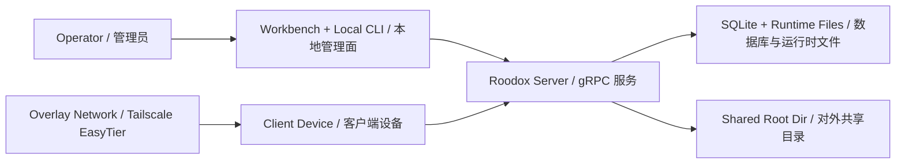

# Architecture And Boundaries / 架构与边界

## Purpose / 目标

Roodox 是一个以 Windows 为优先目标的 gRPC 文件服务，外层带有设备控制面、远程构建能力、TLS/共享密钥交付，以及一个本地 Tauri 运维工作台。  
Roodox is a Windows-first gRPC file service with device control-plane, remote build support, TLS/shared-secret handoff, and a local Tauri operations workbench.

它不是：

- 内建的零信任网络系统  
  It is not a built-in zero-trust network.
- 多租户 SaaS 控制台  
  It is not a multi-tenant SaaS control plane.
- 强制安全默认开启的托管产品  
  It is not a fully managed product with mandatory secure defaults.

## Main Components / 主要组件

| 组件 / Component | 位置 / Location | 作用 / Responsibility | 敏感性 / Sensitivity |
| --- | --- | --- | --- |
| 服务端入口 / Server entry | `cmd/roodox_server` | 启动 gRPC 服务、执行管理型 CLI 选项、Windows Service 入口 | 中 |
| Go 客户端库 / Go client library | `client/roodox_client.go` | 统一拨号、TLS、共享密钥 header、RPC 包装 | 中 |
| 服务实现 / RPC services | `internal/server` | 文件、同步、锁、版本、构建、控制面、管理面实现 | 高 |
| 运行时装配 / Runtime composition | `internal/serverapp` | 组装 DB、清理器、观测、Windows Service、管理快照 | 高 |
| SQLite 层 / SQLite layer | `internal/db` | 元数据、版本内容、设备注册、策略、动作、诊断持久化 | 高 |
| Join Bundle 模型 / Join-bundle model | `internal/accessbundle` | 客户端交付 JSON 结构、规范化、校验 | 高 |
| 配置层 / Config layer | `internal/appconfig` | 默认值、JSON 加载、环境变量覆盖、路径归一化 | 高 |
| PowerShell 运维层 / Operations scripts | `scripts/server` | 启停、升级、回滚、证书、备份、服务注册 | 高 |
| QA 入口 / QA entrypoints | `cmd/roodox_qa` + `scripts/qa` | 活体验证、压测、故障注入、重启恢复验证 | 中 |
| Workbench GUI | `workbench` | 本地运维可视化、配置编辑、交付包导出 | 高 |

## Planes / 项目里的几种“面”

| 平面 / Plane | 典型接口 / Interfaces | 处理的数据 / Data | 主要风险 / Main Risk |
| --- | --- | --- | --- |
| 文件面 / File plane | `CoreService`, `SyncService`, `VersionService` | 文件路径、内容、版本、冲突副本 | 内容泄露、误删、版本回放泄露 |
| 构建面 / Build plane | `AnalyzeService`, `BuildService` | 构建单元、日志、产物 | 构建日志和产物泄露 |
| 控制面 / Control plane | `ControlPlaneService` | 设备注册、策略下发、诊断上传 | 设备身份、诊断内容、挂载路径泄露 |
| 管理面 / Admin plane | `AdminConsoleService`, 本地 CLI, Workbench | 运行态、观测、Join Bundle、备份、关停 | 高权限误用、交付物泄露 |
| 运维面 / Ops plane | `scripts/server`, Windows Service | 进程、证书、数据库、回滚快照 | 误操作导致停机或覆盖 |

## Trust Boundaries / 信任边界

边界解释：

- `Operator` 到 `Workbench` 是本机高权限边界。  
  Whoever controls the operator host can usually export access bundles and read logs.
- `Workbench` 到 `Server` 不是独立的远程 SaaS 边界，而是本地管理边界。  
  The GUI is a local admin frontend over local process/CLI calls.
- `Client Device` 到 `Server` 才是你真正需要保护的远程边界。  
  This is the boundary where TLS and shared-secret posture matters most.
- `Overlay Network` 只是连通性层，不替代 Roodox 的 TLS 或应用认证。  
  Overlay reachability does not replace Roodox transport/auth controls.

## Data Flow / 数据流

### 1. 文件数据流 / File data flow

1. 客户端通过 `CoreService` 或 `SyncService` 读写文件。  
2. 服务端在 `root_dir` 实际读写文件。  
3. 版本元数据和历史内容写入 SQLite。  
4. 观测指标写入内存度量，再被管理面读取。

### 2. 控制面数据流 / Control-plane data flow

1. 设备调用 `RegisterDevice` 报告身份和 overlay 信息。  
2. 服务端把设备记录写入 `device_registry`。  
3. 设备周期性 `Heartbeat`，拉取待执行动作。  
4. 设备通过 `GetAssignedConfig` 获取挂载/同步策略。  
5. 同步状态、挂载状态、诊断内容继续回流到 SQLite。

### 3. 客户端交付流 / Client handoff flow

1. 管理员在 CLI 或 Workbench 里生成 Join Bundle。  
2. 如启用 TLS，再导出客户端要信任的 CA 根证书。  
3. 如启用共享密钥，Bundle 中会包含 `shared_secret`。  
4. 客户端通过 direct 或 overlay 网络连到 gRPC 服务。

## Public Repository Boundary / 公开仓库边界

公开仓库应该只包含源码、脚本、示例配置和脱敏文档，不应包含这些东西：

- 真实 `roodox.config.json`
- `runtime/` 下的日志、PID、升级快照
- `backups/` 下的数据库备份
- `certs/` 下的私钥
- 实际交付给客户端的 Join Bundle
- 带真实路径、真实设备名、真实 secret 的文档示例

## What Usually Changes Together / 常见联动改动

| 你想改什么 / Goal | 典型联动文件 / Usual file set |
| --- | --- |
| 新增或修改 RPC | `proto/roodox_core.proto`, `internal/server/*`, `client/roodox_client.go`, `workbench/src-tauri/src/main.rs` |
| 改配置字段 | `internal/appconfig/config.go`, `roodox.config.example.json`, `workbench/src/App.tsx`, `workbench/src-tauri/src/main.rs` |
| 改 Join Bundle | `internal/accessbundle/bundle.go`, `internal/server/admin_console_service.go`, `internal/serverapp/control_plane_config.go`, `workbench/src-tauri/src/main.rs` |
| 改 TLS/认证 | `internal/server/security.go`, `client/roodox_client.go`, `scripts/server/*.ps1`, 文档 |
| 改设备策略/诊断 | `internal/server/control_plane_service.go`, `internal/server/admin_console_service.go`, `internal/db/device_registry*.go` |

## Maintainer Rule / 维护者规则

先判断你改的是哪一层，再动代码。  
Classify the change first, then edit code.

如果你一开始就只改 Workbench 前端，而没有先判断后端接口、配置归一化、SQLite 持久化和隐私面，后面基本都会返工。  
If you change only the Workbench UI first without checking backend API, config normalization, SQLite persistence, and privacy surfaces, you usually end up reworking it later.
